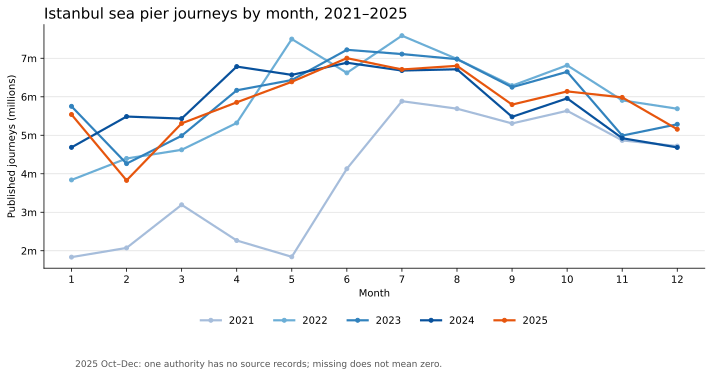
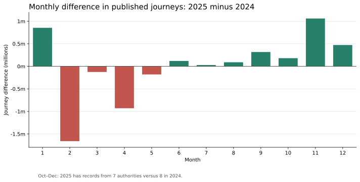

# Istanbul Sea Piers Passenger Journeys (2021–2025)

A Databricks fundamentals project using annual CSV files from the [Istanbul Metropolitan Municipality Open Data Portal](https://data.ibb.gov.tr/dataset). It builds Delta Bronze, Silver, and Gold tables, validates their totals, and compares the published 2024 and 2025 journey counts. The [original 2025 walkthrough](IBB_Deniz_Iskeleleri_2025_Data_Engineering_ordered.sql) remains available as the first stage of the project.

## Findings

| Year | Source rows | Months | Published journeys |
| ---: | ---: | ---: | ---: |
| 2021 | 979 | 12 | 47,445,145 |
| 2022 | 978 | 12 | 71,572,152 |
| 2023 | 1,000 | 12 | 72,087,043 |
| 2024 | 970 | 12 | 70,283,867 |
| 2025 | 958 | 12 | 70,513,663 |

Across the five files, 4,885 source rows were loaded and reconciled against the monthly and authority Gold totals. The difference between the **published** 2025 and 2024 annual totals is **+229,796 (+0.33%)**. February 2025 was 1,658,742 below February 2024; November was 1,060,492 above November 2024.

**Coverage limitation:** `ISTANBUL SEHIR HATLARI TUR. SAN. VE TIC. AS.` has no rows for October–December 2025, while the corresponding 2024 months have records. Those 2025 months contain seven observed authorities versus eight in 2024. The missing rows are not assumed to represent zero journeys. The annual and final-quarter differences compare the files as published, not necessarily like-for-like activity.

## Data pipeline

| Stage | Table(s) | What happens |
| --- | --- | --- |
| Raw | Five CSVs in `/Volumes/workspace/default/ibb_raw/` | Keep the source files in a Unity Catalog Volume. |
| Bronze | `workspace.default.ibb_deniz_iskeleleri_bronze` and `workspace.default.ibb_deniz_iskeleleri_bronze_2021_2024` | Keep source fields as text plus `_metadata.file_path` for lineage. The 2025 CSV uses `;` and `yolcu_sayisi`; 2021–2024 use `,` and `toplam_yolculuk_sayisi`. |
| Silver | `workspace.default.ibb_deniz_iskeleleri_silver_2021_2025` | Cast year, month, and journey counts; normalize empty station names; combine the two Bronze tables with `UNION ALL`. |
| Gold | `workspace.default.ibb_deniz_iskeleleri_gold_aylik_2021_2025`, `_gold_yillik_2021_2025`, `_gold_aylik_otorite_2021_2025`, `_gold_karsilastirma_2024_2025` | Prepare monthly, yearly, authority-month, and 2024–2025 comparison tables. |

The 2021–2025 Silver check found 12 months in every year, 181 rows without a station name, and no repeated `(yil, ay, otorite_adi, istasyon_adi)` keys in this snapshot. Gold totals reconcile to Silver by year. A source coverage comparison locates the three missing 2025 authority-month combinations.

## Run in Databricks

1. Upload all five annual source CSVs to `/Volumes/workspace/default/ibb_raw/` using the paths in the notebooks. The raw data and Delta tables are not included here; change paths and `workspace.default` if your workspace differs.
2. Run [the 2025 SQL notebook](IBB_Deniz_Iskeleleri_2025_Data_Engineering_ordered.sql) first. Its Bronze creation step provides `workspace.default.ibb_deniz_iskeleleri_bronze`, an input to the combined notebook.
3. Import and run [the 2021–2025 notebook](IBB_Deniz_Iskeleleri_2021_2025_Data_Engineering.ipynb) top to bottom using compatible Databricks SQL/serverless compute. An [ordered SQL source export](IBB_Deniz_Iskeleleri_2021_2025_Data_Engineering_ordered.sql) is also provided for reading or importing.
4. Check the yearly counts above, the 60 monthly Gold rows, the duplicate-key query's empty result, and the October–December authority coverage gap.

The `CREATE OR REPLACE TABLE` statements rebuild the Delta tables and add write history on repeated runs. The exported `.ipynb` includes saved table results and Databricks visualization definitions; its interactive charts need Databricks to render. The two SVG figures above are portable views of the saved query results.

## Reproduce the figures without Databricks

The small CSV files in [`results/`](results/) were transcribed from the executed notebook outputs and reconciled to the yearly totals. With Python and Matplotlib installed, run `python plot_results.py` to regenerate the SVG figures. This reproduces the **figures from saved aggregates**, not the Bronze-to-Gold pipeline; the original source CSVs and Databricks workspace are required for the latter.

## Interpretation limits

`yolcu_sayisi` is summed as a journey count, not a count of unique annual people. The source definition of `tekil_yolcu_sayisi` has not been independently verified, so its sum is not reported as annual unique passengers. The reason for the missing 2025 authority-month records cannot be determined from these files alone. This is a fixed-snapshot learning project without incremental ingestion or a scheduled pipeline.
